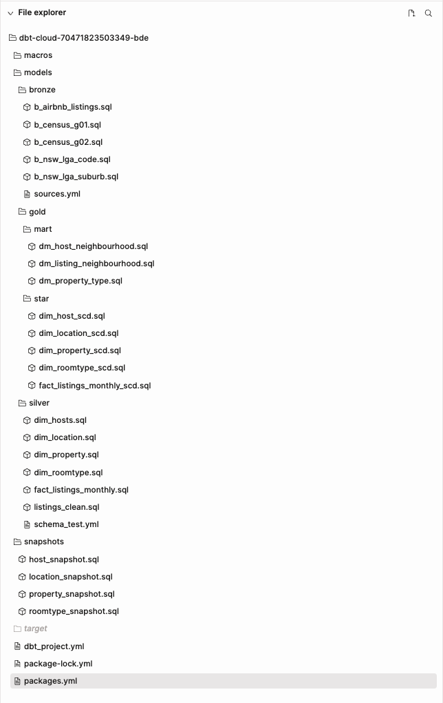

# Airbnb ELT Data Pipeline with dbt Cloud and Apache Airflow


## Project Overview
A complete end-to-end ELT pipeline for Airbnb combined with NSW Census data built with Apache Airflow, Google Cloud Platform (GCP), PostgreSQL, and dbt Cloud.
This project is part of my Big Data Engineer course in UTS, demonstrating modern data engineering practices through automated ingestion, transformation, and BI analytics reporting.

This pipeline ingests monthly Airbnb listing data, loads it into a data warehouse following a Bronze/ Silver/ Gold architecture, and produces analytics-ready models and final insights.

Tools used:
- Airflow for workflow orchestration
- Google Cloud for storage and execution
- Postgres as the data warehouse
- dbt Cloud for transformations, testing, and snapshots
- DBeaver for final insights using sql

The end result includes a PDF business report summarising Airbnb performance trends, host revenue patterns, and neighbourhood-level insights.

## Architecture

### Warehouse Architecture
- Bronze: raw CSV ingestion from Postgres.
- Silver: cleaned & typed staging models.
- Gold: business logic models (revenue, neighbourhood patterns, host metrics) including data marts.

### dbt Structure Preview


## Project Structure
```
Directory structure:
└── huyducv/dbt-airbnb/
    ├── analyses-sql/
    │   ├── part_1.sql
    │   └── part_4.sql
    │
    ├── dag/
    │   ├── dag_part_1.py
    │   └── dag_part_2.py
    │
    ├── dbt/
    │   ├── models/
    │   │   ├── bronze/
    │   │   │   ├── b_airbnb_listings.sql
    │   │   │   ├── b_census_g01.sql
    │   │   │   ├── b_census_g02.sql
    │   │   │   ├── b_nsw_lga_code.sql
    │   │   │   ├── b_nsw_lga_suburbs.sql
    │   │   │   └── sources.yml
    │   │   ├── silver/
    │   │   │   ├── dim_hosts.sql
    │   │   │   ├── dim_location.sql
    │   │   │   ├── dim_property.sql
    │   │   │   ├── dim_roomtype.sql
    │   │   │   ├── fact_listings_monthly.sql
    │   │   │   ├── listings_clean.sql
    │   │   │   └── schema_test.yml
    │   │   └── gold/
    │   │   │   ├── mart/
    │   │   │   │   ├── dm_host_neighbourhood.sql
    │   │   │   │   ├── dm_listing_neighbourhood.sql
    │   │   │   │   └── dm_property_type.sql
    │   │   │   └── star/
    │   │   │   │   ├── dim_host_scd.sql
    │   │   │   │   ├── dim_location_scd.sql
    │   │   │   │   ├── dim_property_scd.sql
    │   │   │   │   ├── dim_roomtype_scd.sql
    │   │   │   │   └── fact_listings_monthly_scd.sql
    │   ├── snapshots/
    │   │   ├── host_snapshot.sql
    │   │   ├── location_snapshot.sql
    │   │   ├── property_snapshot.sql
    │   │   └── roomtype_snapshot.sql
    │   ├── dbt_project.yml
    │   ├── package-lock.yml
    │   └── packages.yml
    │
    ├── report/
    │   └── Airbnb_Report.pdf
    │
    └── README.md

```

## Setup
### 1. Airflow
- Serve as ingestion and data pipeline tool, handling end-to-end flow.
- Runs `analyses-sql/part_1.sql` to create initial Bronze table in PostgreSQL.
- Initially ingest May 2020 data file (Airbnb) and Census data (`dag/dag_part_1.py`).
- Automate the process to ingest remaining data (`dag/dag_part_2.py`).
- After each successful load, Airflow archive the file to avoid flexibility.

### 2. dbt Cloud
- Create data warehouse using medallion architecture (Bronze/ Silver/ Gold).
```
dbt deps

dbt run
dbt snapshot
```

### 3. Prerequisites
- **Google Cloud Platform**: Cloud Composer (Apache Airflow) and Cloud SQL (PostgreSQL).
- **dbt Cloud**: Configure to connect to Postgres instance.

## Report 
The final project handout and Airbnb analytics report is available in this repository at: [Report](https://github.com/huyducv/dbt-airbnb/blob/main/report/Airbnb_Report.pdf)

